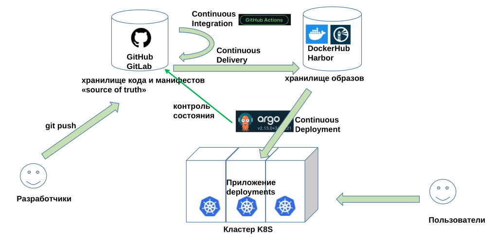
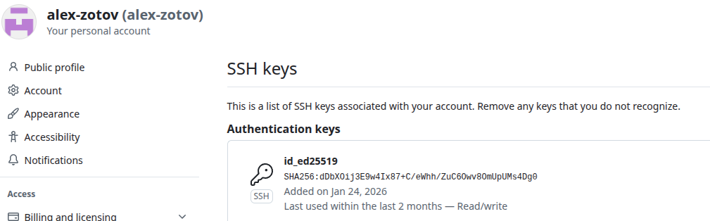
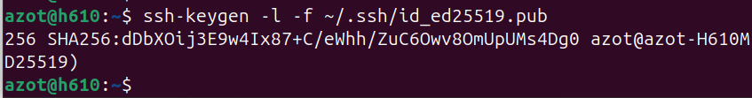
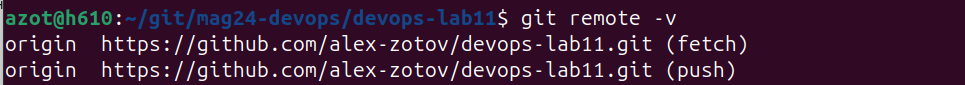

## DevOps зима 2026
## Лаб11: CI/CD – непрерывная интеграция, развертывание и доставка

Полная схема стенда CI/CD


CI = Continuous Integration  
Любые коммиты в ветку dev должны автоматически запустить серию интеграционных процессов
- Линтинг
- Юнит-тесты
- Сборка приложения
- Интеграционные тесты

Практика: Создаем Cloud-native приложение для экспериментов
1. Создаем само приложение
2. Создаем юнит тесты для приложения
3. Докеризируем: Создаем докерфайл для сборки контейнера
4. Описываем CI-сценарии для Github Actions производящие lint, unit-test, build-test
5. Куберизируем: Создаем манифесты для запуска приложения и сервисов в кластере
6. Описываем CD-сценарии для Github Actions производящие docker build и push в Docker Hub
7. Устанавливаем ArgoCD и подключаем к GitHub
8. Проверяем весь CI/CD workflow в сборе

### Проверим, что в git есть ключ


git показывает хэш публичного ключа. локально хэш такой же
```
ssh-keygen -l -f ~/.ssh/id_ed25519.pub
```


### Создаём пустой репозиторий

### Приложение
[applicattion.py](./server/application.py) - веб сервер. по умолчанию показывает список файло текущего каталога

[test_application.py](./server/test_application.py) - юнит тесты. Тестируем методы класса TestMe из applicattion.py. Используем библиотеку PyTest

[requirements.txt](./requirements.txt) - файл зависимостей

[dockerfile](./server/dockerfile) - файл для сборки образа

### проверим git
настроил чтоб все изменения уходили по ssh
```
git remote -v
git remote set-url origin git@github.com:alex-zotov/devops-lab11.git
```


```
git status
```
-a добавил все изменения в commit (-m коммент)
```
git commit -a -m server
git push
```

