## DevOps зима 2026
## Лаб11: 
## CI/CD – непрерывная интеграция, развертывание и доставка

Полная схема стенда CI/CD


CI = Continuous Integration  
Любые коммиты в ветку dev должны автоматически запустить серию интеграционных процессов
- Линтинг
- Юнит-тесты
- Сборка приложения
- Интеграционные тесты

Практика: Создаем Cloud-native приложение для экспериментов
1. Создаем само приложение
2. Создаем юнит тесты для приложения
3. Докеризируем: Создаем докерфайл для сборки контейнера
4. Описываем CI-сценарии для Github Actions производящие lint, unit-test, build-test
5. Куберизируем: Создаем манифесты для запуска приложения и сервисов в кластере
6. Описываем CD-сценарии для Github Actions производящие docker build и push в Docker Hub
7. Устанавливаем ArgoCD и подключаем к GitHub
8. Проверяем весь CI/CD workflow в сборе

### Проверим, что в git есть ключ


git показывает хэш публичного ключа. локально хэш такой же
```
ssh-keygen -l -f ~/.ssh/id_ed25519.pub
```


### Создаём пустой репозиторий

### Приложение
[applicattion.py](./server/application.py) - веб сервер. по умолчанию показывает список файло текущего каталога

[test_application.py](./server/test_application.py) - юнит тесты. Тестируем методы класса TestMe из applicattion.py. Используем библиотеку PyTest

[requirements.txt](./requirements.txt) - файл зависимостей

[dockerfile](./server/dockerfile) - файл для сборки образа

### проверим git
настроил чтоб все изменения уходили по ssh
```
git remote -v
git remote set-url origin git@github.com:alex-zotov/devops-lab11.git
```


```
git status
git add .
git commit -m server
git push
```

запишу временно readme.md и pic в .gitignore
и удалю их временно из индекса (--cached) git
```
git rm --cached readme.md
git rm -r --cached pic
git commit -m ditignore
git push
```

### Переводим разработку в отдельную ветку dev
```
git checkout -b dev
```
эквивалентно 
```
git branch dev      # создать ветку dev
git checkout dev    # переключиться на ветку dev
```

устанавливаем связь локальной ветки и ветки в github
```
git push -u origin dev
```
или эквивалент без сокращений
```
git push --set-upstream origin dev
```
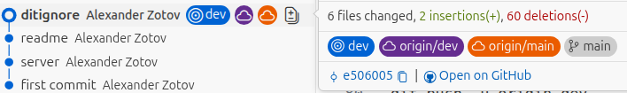

### Защищаем ветку master от прямых изменений
теперь только merge-requests. Все изменения делаем в dev. Для переноса в main идём в гитхаб, и производим merge/pull request > approve 
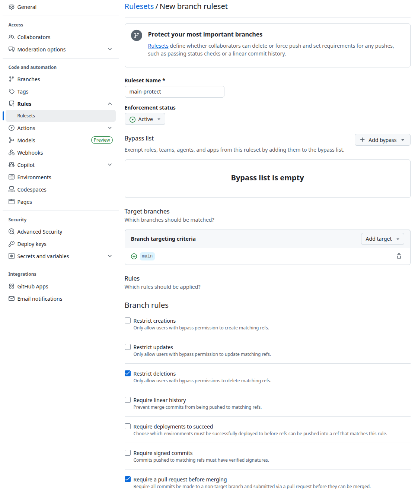

### Пример
добавляем индексный файл, пушим, открываем pull/merge-request
```
echo "">index.html
git add index.html
git commit -m test
git push
```
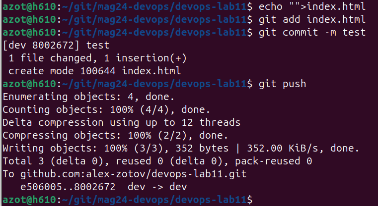  
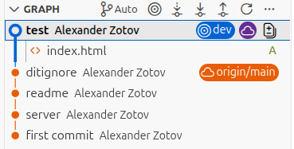

идём на githab. открываем pull request
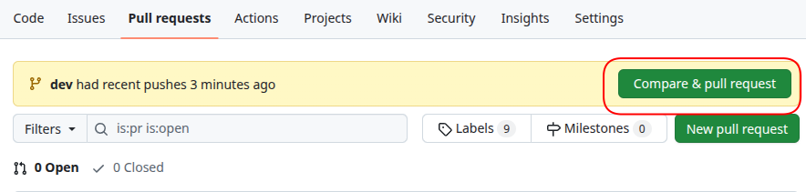  
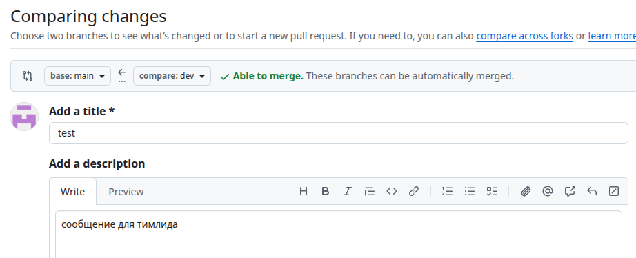  

тимлид делает слияния с main
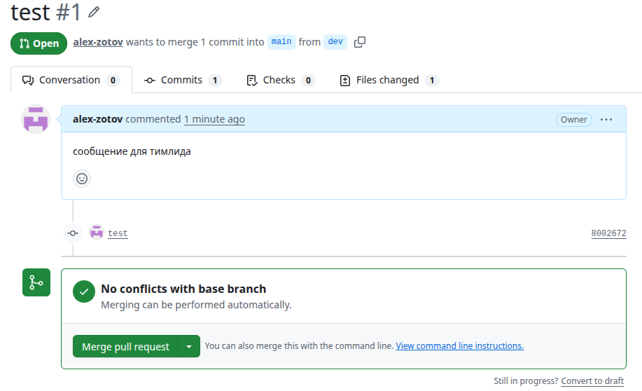  
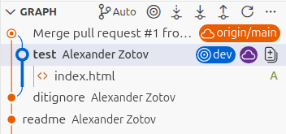


## CI = Continuous Integration. Github Actions

- Создаются в виде скриптов («пайплайн», workflow) из нескольких шагов
- Выполняются на отдельной vm на стороне github («shared runner»)
- Имееют доступ в наш репо
- Могут оставлять артефакты

Разрешаем action
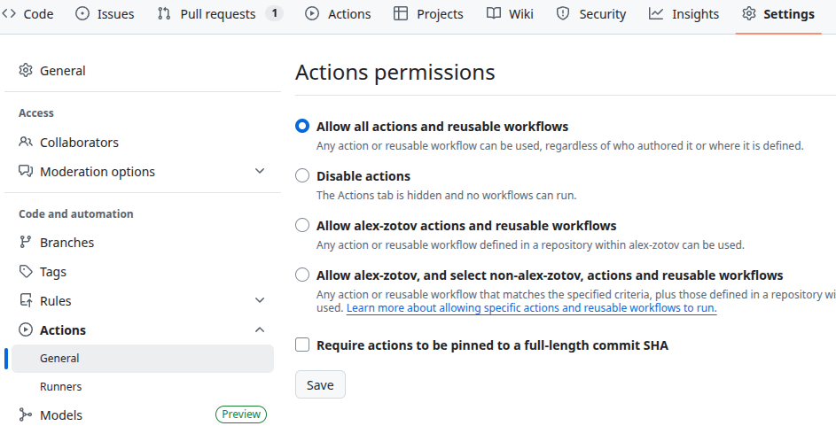

Добавляем CI-пайплайны (сценарии) – Github Actions
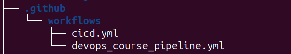

### Тестовый сценарий
[devops_course_pipeline.yml](./.github/workflows/devops_course_pipeline.yml) - посмотреть как работает runner на стороне GitHub

отправляем в git
```
git add .github/
git commit -m ci
git push
```
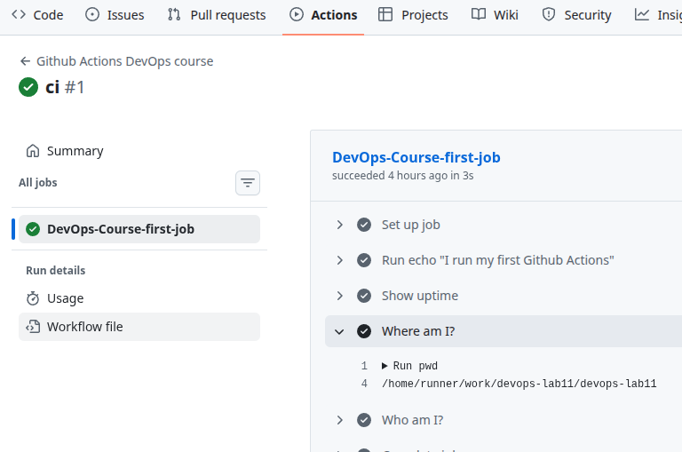

### Боевой сценарий 
линтер > юнит-тесты > интеграционный тест
[cicd.yml](.github/workflows/cicd.yml)
```
git commit -a -m cicd.yml
git push
```
линтер ругается на docstring
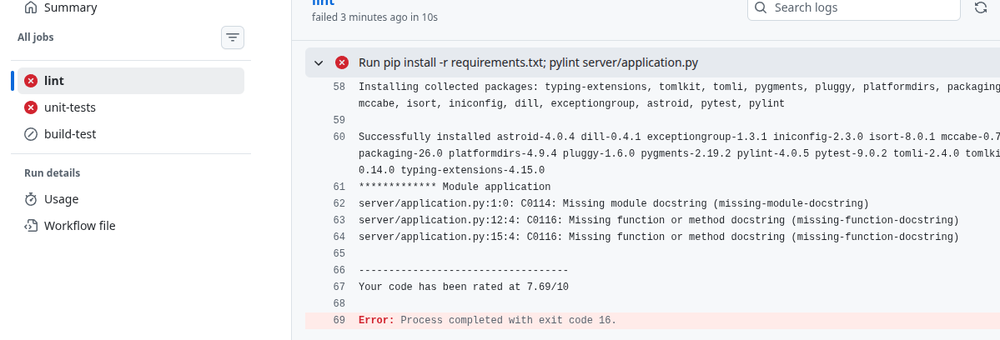

выключим коды сигнатур C0114 C0116 из проверки линтера  
Добавляем в пайплайне [.github/workflows/cicd.yml](.github/workflows/cicd.yml) на стадии линтера ключ -d и перечисляем
коды сигнатур для отключения через запятую
```
pylint -d C0114,C0116 server/application.py
```
или можно прямо в application.py дать указание линтеру
```
# pylint: disable=C0114,C0116
```
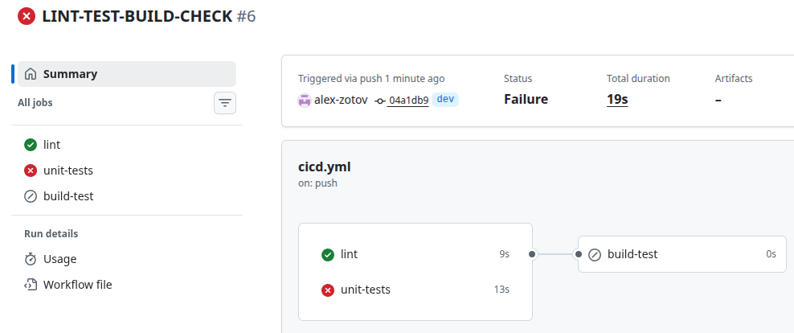

после правок в takeFive проойдены unit-tests
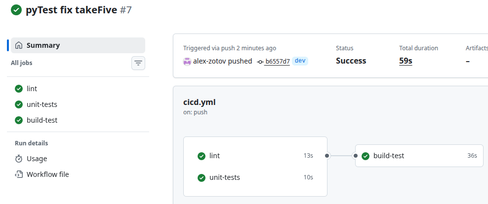

со стороны тимлида
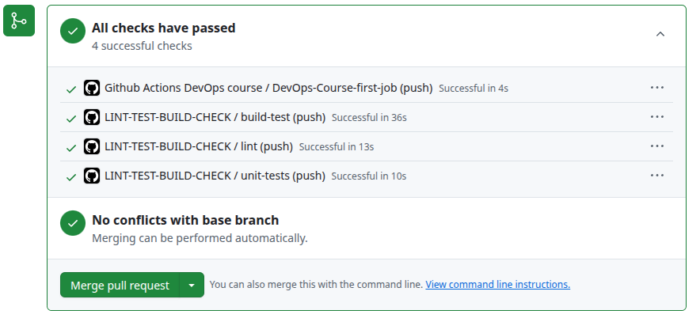

после слияния веток  
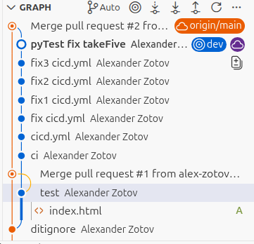

сделать бэдж в readme.md  
create status badge - там markdown заготовка  
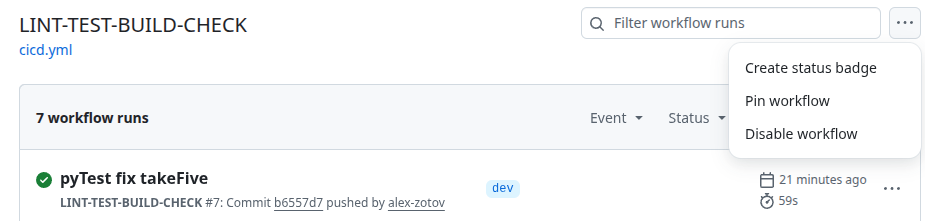  

вставил заготовку  
[](https://github.com/alex-zotov/devops-lab11/actions/workflows/cicd.yml)

## Создаём для приложения k8s-манифесты
```
mkdir server-k8s-manifests
cd server-k8s-manifests
```

### Continuous Delivery
- Добавляем публикацию докер-образа приложения в хранилище
- Зарегистрироваться в dockerHub и создать паблик-репо для образов
- Этот репо далее укажем как источник образа в k8s манифесте

новый репозиторий в docker hub
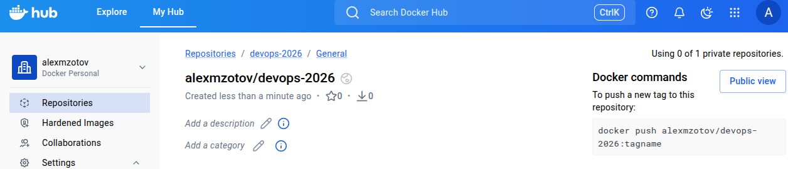

### Манифест k8s
[app.yml](./server-k8s-manifests/app.yml) и deployment, и service одним файлом. --- отделяют объекты
- release-date: RELEASE-DATE - CI пайплайн будет подставлять новое значение, чтобы ArgoCD «увидел» изменение манифеста
- image: alexmzotov/devops-2026:latest - путь к репозиторию

### Проверяем/запускаем minikube
```
minikube start
```

Там еще могут оставаться контейнеры с прошлых занятий. Удаляем.
```
kubectl get deployments
kubectl get services
kubectl delete services dev-redis dev-web
kubectl delete services prod-redis prod-web
kubectl delete deployments dev-redis dev-web
kubectl delete deployments prod-redis prod-web
```
### Cобираем образ. Выкладываем в dockerHub
Собираем образ приложения в докере. Тэг должен совпадать с именем репозитория в dockerhub
```
docker image build -t alexmzotov/devops-2026 ./server/
```
логинимся в докере
```
docker login
```
кладём образ в docker hub
```
docker push alexmzotov/devops-2026
```
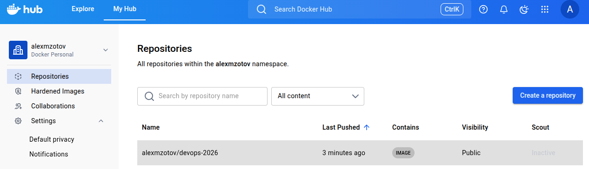


### Применяем манифесты
```
kubectl create namespace devops-psu
kubectl apply -f ./server-k8s-manifests/app.yml
```

в отдельном окне запускаем туннель
```
minikube tunnel
```

проверяем
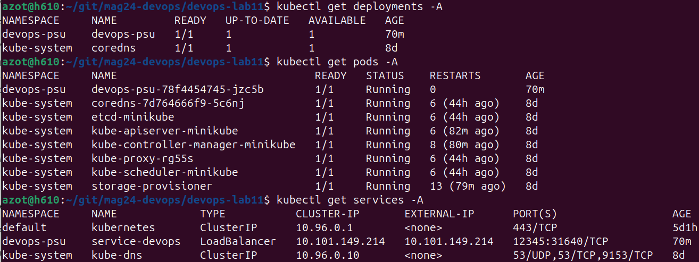
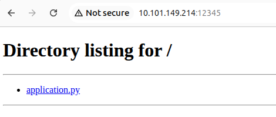

### Сохраняем манифесты в git
```
git status
git add ./server-k8s-manifests/
git commit -m k8s
git push
```

## CD = Continuous Delivery and/or Deployment
Будем создавать хранилище докер-образов.
CD-служба будет брать из хранилища новые образы и разворачивать их в кластере k8s

### Create Access Token
В профиле DockerHub / Account settings / Personal access tokens / Create access token
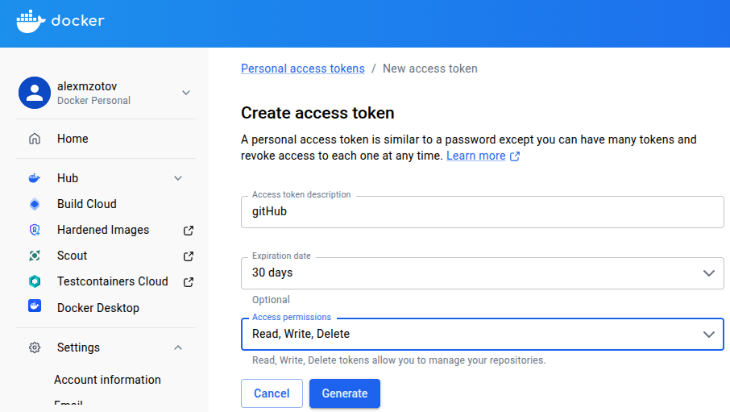

### Добавляем свои учетные данные как Action Secrets на github
Два секрета – DOCKER_USERNAME и DOCKER_TOKEN  
Settings / Secrets and variables / Actions   
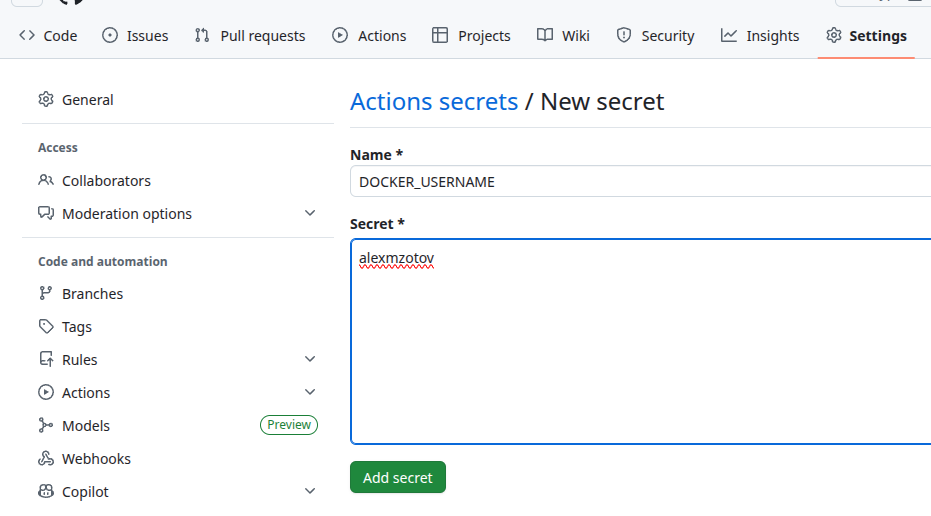

### Пайплайн для сборки и публикации образа в Docker Hub
[.github/workflows/release.yml](.github/workflows/release.yml)
- **branches: [ master ]** - На этот раз работает в ветке мастер (в неё попадают уже оттестированные изменения).
- **permissions / contents: write** - Разрешаем пайплайну делать коммиты в репозиторий
- **username: \${{ secrets.DOCKER_USERNAME }}** - Логинимся в докер-хаб с использованием секретного токена
- **push: true** - Сохраняем свежий образ на ДокерХабе

Вторая часть (jobs / touch-k8s-manifest:) пайплайна заносит дату сборки в файл манифеста и коммитит в ветку release.  
Это требуется, чтобы на CD стадии мы увидели не просто коммит, а обновление манифеста.

**Note:** Популярна схема, когда приложение лежит в одном репо, а манифесты в отдельном репо.
Пайплайн после сборки образа вносит в репо с манифестами конкретный хэш собранного образа.
Далее на стадии CD будет использоваться не просто latest образ, а образ с конкретным хэшем.

### Пример отработки пайплайна release.yml
Делаем коммит новых файлов в репо, создаем pull-request и выполняем merge в main
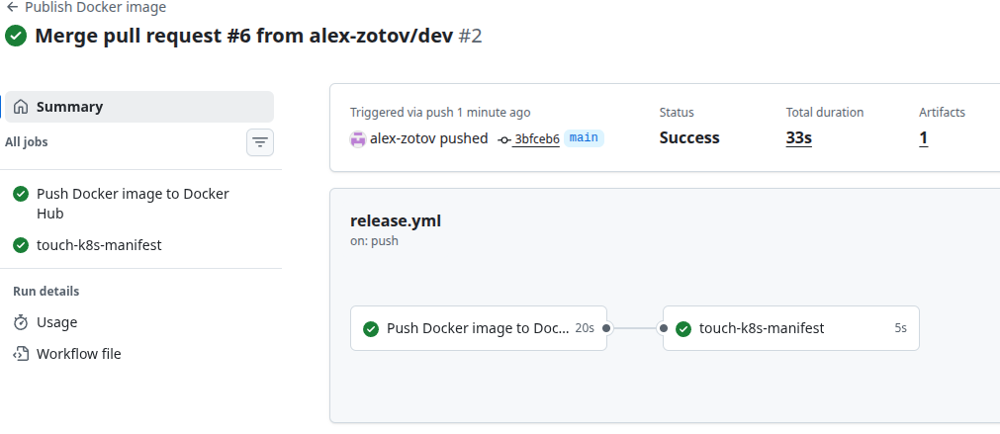

видим свежий образ в dockerHub
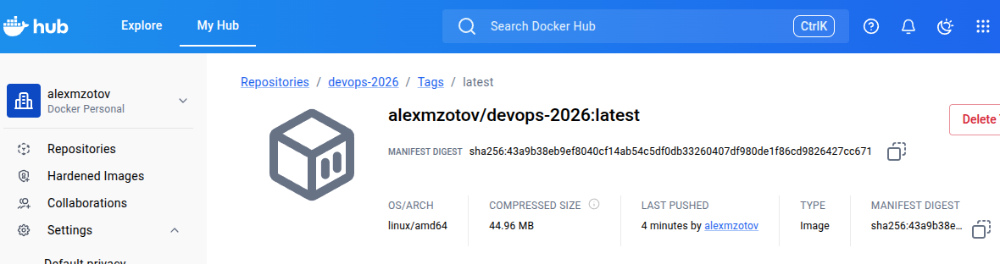

### На текущий момент стратегия работы с ветками выглядит так
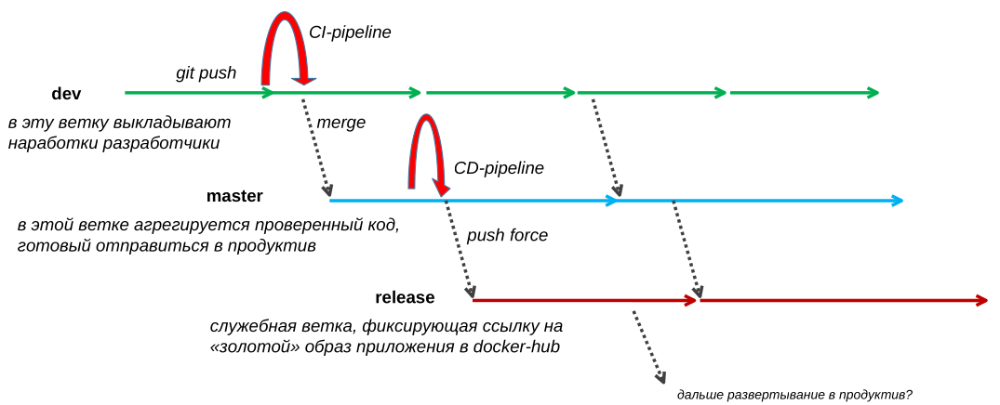

## Continuous Deployment: ArgoCD
ArgoCD – инструмент непрерывной доставки в парадигме GitOps

ArgoCD имеет свой CLI и работает декларативно через yml, также имеет WebUI

### Устанавливаем ArgoCD
создаем отдельное пространство имён
```
kubectl create namespace argocd
```

скачиваем и устанавливаем всё из манифеста (в две строчки)
```
kubectl apply -n argocd \
-f https://raw.githubusercontent.com/argoproj/argo-cd/stable/manifests/install.yaml
```

Подождать, пока все модули ArgoCD станут READY 1/1
```
kubectl get deployments -n argocd
```
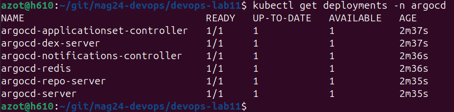

Вытаскиваем стартовый админский пароль – он поторебуется для входа в интерфейс (в две строчки)
```
kubectl -n argocd get secret argocd-initial-admin-secret \
--template={{.data.password}} | base64 -d
```

Пробрасываем api-сервис ArgoCD наружу (в две строчки)
```
kubectl patch svc argocd-server -n argocd \
-p '{"spec": {"type": "LoadBalancer"}}'
```
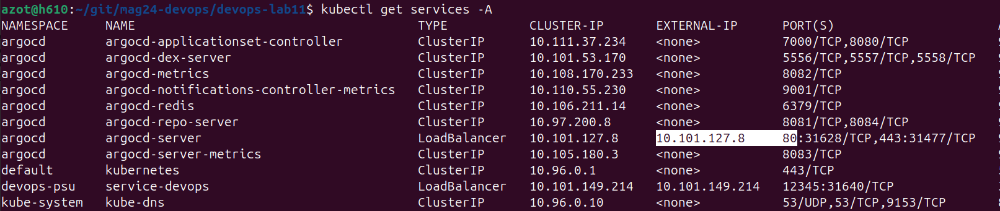

Используем имя admin и пароль с предыдущего шага
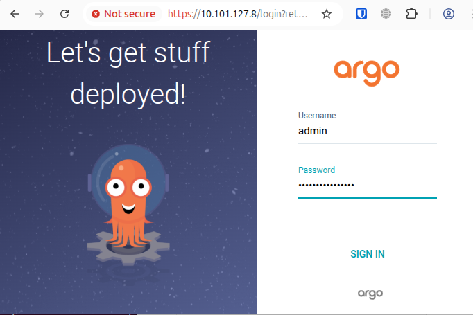

### Подключаем к ArgoCD наш GitHub репо с использованием приватного ключа
Сгенерируем ключевую пару ssh и(или) возьмем существующую  
У этого ключа должен быть доступ до репо github  
Ключ должен быть без парольной фразы. 
Положить приватный ключ на Argo

Argo / Settings / Repositories
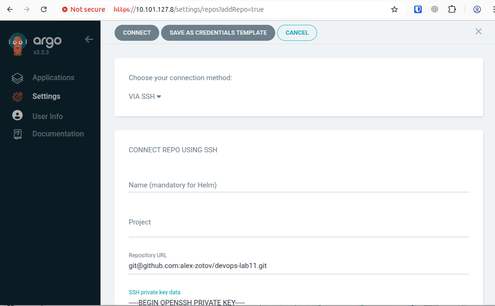

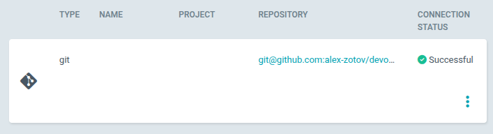

### Подключаем манифесты приложения для контроля состояния
Application / New App  
New App (1)  
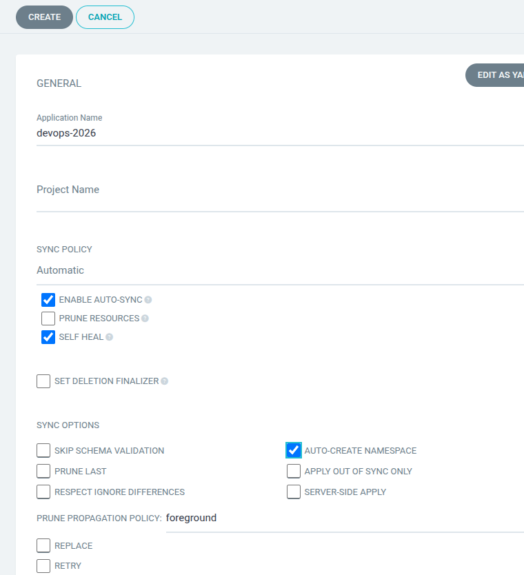

Выбираем репо, указываем ветку для отслеживания и путь к манифестам  
New App (2)  
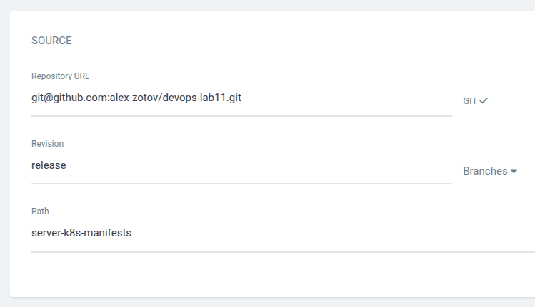

Указываем реквизиты кластера k8s и пространство имен  
New App (3)  
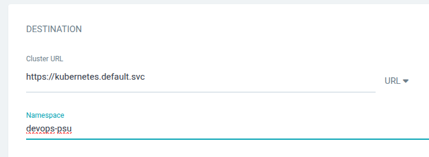

### Приложение установлено на контроль ArgoCD
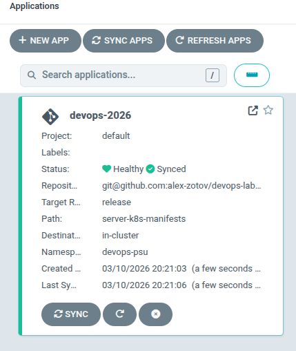

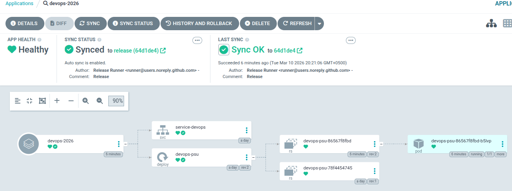

### Проверка
#### Изменяем приложение: добавляем ииндексный файл
- правим содержание индекса
```
echo "Hello! I'm version 2" > ./server/index.html
```
- добавляем индекс в [dockerfile](./server/dockerfile)
```
ADD ./index.html /usr/local/http-server/index.html
```

### Отправляем изменения в ветку dev
```
git status
git commit -a -m index.html
git push
```

### На стороне Github открывает Pull Request
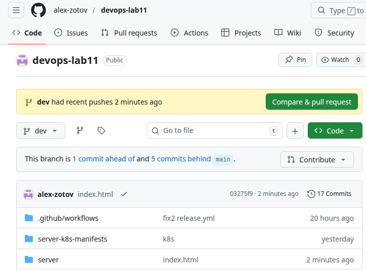

### Проводим «код ревью» и после успешных тестов проводим Merge
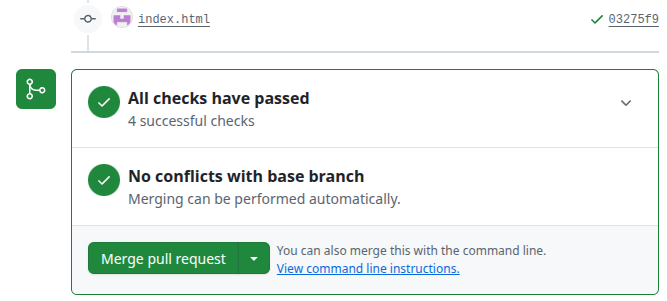

### На ветке master сработает пайплайн на релиз
новый образ будет отправлен на DockerHub, манифест будет пропатчен  
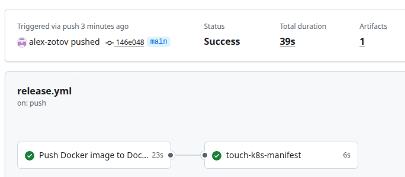

### ArgoCD подхватит изменения манифеста и синхронизирует состояние в k8s
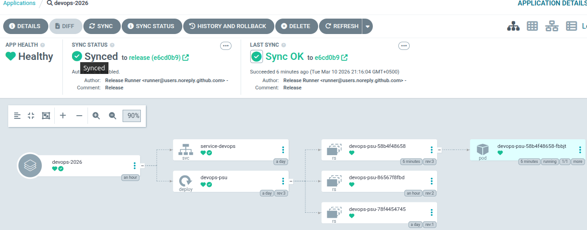

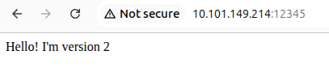
